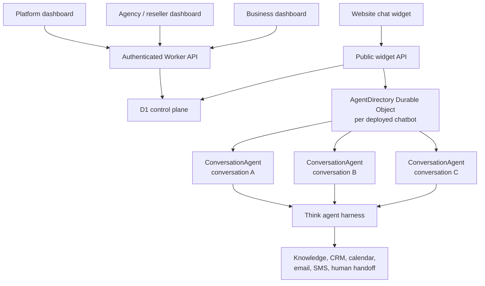
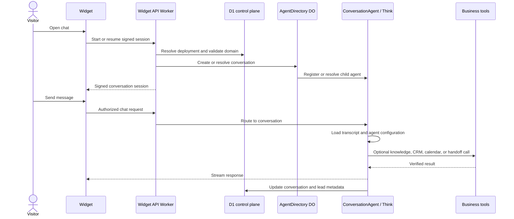

# Multi-tenant agent platform architecture

A proposed Cloudflare architecture for selling managed website chat agents to businesses, supporting agency management, client dashboards, CRM-style lead tracking, and white-label resellers.

> This document describes the intended product architecture. It is not an implementation already present in this repository.

## Product model

The platform has four ownership levels:

1. **Platform owner** — operates the SaaS and can administer every account.
2. **Agency or white-label reseller** — sells and manages the service under its own brand.
3. **Business client** — owns one or more website agents and views its leads and conversations.
4. **Website visitor** — talks to an agent anonymously or becomes an identified lead.

Use one hierarchical `Organization` model rather than separate account systems for agencies and resellers:

```text
Platform
└── Agency or reseller
    ├── Business client A
    │   ├── Sales agent
    │   └── Support agent
    └── Business client B
        └── Sales agent
```

An organization has a `parentOrganizationId`, type, branding, billing ownership, and feature policy. A user receives permissions through an organization membership. The same authorization system can therefore support platform administrators, agency operators, reseller operators, business administrators, and read-only business users.

## Recommended Cloudflare architecture

Separate the system into a global **control plane** and a durable **conversation data plane**.



### Control plane

Use D1 for globally queryable product records:

- Organizations and their parent-child relationships
- Users, memberships, and roles
- White-label branding and domains
- Business profiles
- Agent definitions and deployed website widgets
- Public widget keys mapped to internal deployment IDs
- Conversation metadata
- Lead records and qualification status
- Assignments, tags, notes, and human handoff state
- Usage, plan limits, and billing references
- Audit events

D1 is appropriate for dashboards because it can query across organizations, businesses, agents, and conversations. Individual Durable Object databases are isolated and should not be treated as a global reporting database.

### Conversation data plane

Use the Agents SDK for live agent instances:

- One top-level `AgentDirectory` Durable Object per deployed chatbot
- One `ConversationAgent extends Think` sub-agent per conversation
- The directory owns the authoritative child-agent registry
- Each conversation owns its message history, streaming state, recovery state, and active connections
- Think supplies the model-and-tool loop

A deployed chatbot is the operational unit identified by an internal `agentDeploymentId`. A business may have several deployments, such as a sales agent and a support agent.

```text
AgentDirectory/{agentDeploymentId}
├── ConversationAgent/{conversationId}
├── ConversationAgent/{conversationId}
└── ConversationAgent/{conversationId}
```

This directly follows the parent-directory and child-chat pattern in `examples/multi-ai-chat`.

## Durable Object creation and identity

Agents are created on demand. The system deploys the agent class first; it does not pre-create every Durable Object.

A Durable Object instance is selected by:

```text
agent class + instance name
```

For example:

```text
AgentDirectory + deployment_acme_sales
ConversationAgent + conversation_7fbd42
```

The first request or RPC for a name creates or wakes the corresponding instance. The same name resolves to the same durable storage later, even after the in-memory instance has been evicted.

The deployed class already contains methods such as:

```ts
export class ConversationAgent extends Think<Env> {
  getModel() {
    return "@cf/moonshotai/kimi-k2.7-code";
  }

  getSystemPrompt() {
    return "You are a helpful business representative.";
  }

  getTools() {
    return {
      searchKnowledge,
      submitLead,
      requestHumanHandoff
    };
  }
}
```

The system prompt is code or durable configuration resolved when Think handles a turn. It does not need to be attached before the Durable Object exists.

## Agent configuration

Store each chatbot's configurable definition in the control plane:

- Business identity and approved description
- Agent purpose, such as sales, support, or scheduling
- Persona and behavioral rules
- Model tier
- Enabled tools
- Knowledge sources
- Qualification questions
- Escalation and human-handoff policy
- Contact collection and consent language
- Working hours
- CRM, calendar, email, and messaging integration references

Do not store secrets in system prompts or browser-visible configuration. Tools should use server-side bindings or encrypted integration credentials.

At turn time, `ConversationAgent` obtains the current configuration from its directory or from a durable local configuration snapshot. This allows an administrator to update the prompt or tool policy without recreating every conversation.

If exact historical reproducibility becomes necessary, add a configuration version to each turn. Until then, applying the latest active configuration on the next turn is the simpler policy.

## Creating and tracking conversations

The website widget must not invent arbitrary Durable Object names. Use a server-controlled creation flow:

1. The widget sends its public deployment key to the Worker.
2. The Worker resolves the internal deployment and validates the requesting domain.
3. The Worker resolves `AgentDirectory/{agentDeploymentId}`.
4. The directory generates a random `conversationId`.
5. The directory calls `subAgent(ConversationAgent, conversationId)`.
6. The platform inserts conversation metadata in D1.
7. The server returns a signed conversation session to the browser.
8. The widget connects to the registered child conversation.

The directory should reject child names that were never registered:

```ts
override async onBeforeSubAgent(
  _request: Request,
  { className, name }: { className: string; name: string }
) {
  if (!this.hasSubAgent(className, name)) {
    return new Response("Not found", { status: 404 });
  }
}
```

Use the framework registry for existence:

- `subAgent()` creates or resolves a child and registers it
- `listSubAgents()` lists registered conversations for that directory
- `hasSubAgent()` checks whether a child is valid
- `deleteSubAgent()` removes a conversation child

Use D1 for cross-tenant and dashboard metadata:

- Conversation title
- Business and deployment IDs
- Anonymous visitor ID
- Lead ID, when known
- Created and last-active times
- Last-message preview
- Qualification stage
- Assigned team member
- Open, handed-off, closed, or archived status

The framework registry answers **whether the conversation exists**. D1 answers **how the product should display, search, authorize, and report on it**.

## Visitor identity

A website visitor begins anonymously. Create random first-party identifiers rather than browser fingerprints:

```text
visitorId = random opaque ID
conversationId = random opaque ID
```

Store the browser session in a signed, secure cookie. It identifies the browser session, not a verified person.

When the visitor voluntarily provides a name, email address, or phone number, create or update a lead and link it to the existing conversation:

```text
anonymous conversation
        ↓
visitor provides contact details and follow-up consent
        ↓
conversation linked to CRM lead
```

For cross-device access, require authentication, a verified email link, or an explicit secure resume link. Do not rely on IP addresses or browser fingerprinting.

## Conversation and CRM dashboard

The dashboard should query D1 for lists and summaries rather than scanning Durable Objects.

For an initial version:

- Keep the authoritative full transcript in the conversation Durable Object
- Keep searchable list metadata and the latest preview in D1
- When a user opens one thread, authorize the request and fetch that transcript from the specific conversation agent

This avoids duplicating every message before global transcript search is required. If full-text search, analytics, exports, or compliance retention later require central message storage, add an idempotent message projection into D1 or another analytics store.

Business users may receive read-only access to:

- Conversation threads
- Lead contact information collected with consent
- Qualification status
- Agent and tool activity
- Appointment or handoff outcomes
- Assigned salesperson
- Tags and conversation summaries

Agency and reseller operators may manage configuration for businesses within their organization scope. Platform operators may administer all descendants. Authorization must be enforced by the server on every query and agent route; the dashboard UI is not an authorization boundary.

## Roles and permissions

A small role set is sufficient initially:

| Role                             | Scope                  | Capabilities                                                             |
| -------------------------------- | ---------------------- | ------------------------------------------------------------------------ |
| Platform administrator           | Entire platform        | Manage organizations, plans, operators, and all agents                   |
| Agency or reseller administrator | Descendant businesses  | Create businesses, configure agents, view conversations, manage branding |
| Agency operator                  | Assigned businesses    | Operate agents and leads without billing or ownership changes            |
| Business administrator           | One business           | View conversations and leads, configure allowed business settings        |
| Business viewer                  | One business           | Read-only conversations, leads, and outcomes                             |
| Human agent                      | Assigned conversations | Take over, reply, add notes, and close conversations                     |

White labeling should be organization configuration, not a separate codebase:

- Custom logo and colors
- Custom dashboard domain
- Email sender identity
- Customer-facing legal and support links
- Feature visibility
- Reseller-owned billing presentation

All white-label tenants should continue using the same authorization, data model, Worker code, and Durable Object classes.

## End-to-end message flow



## Source-of-truth boundaries

Use one authoritative owner for each category:

| Data                                                | Authoritative owner                               |
| --------------------------------------------------- | ------------------------------------------------- |
| Organization hierarchy and memberships              | D1 control plane                                  |
| White-label branding and plans                      | D1 control plane                                  |
| Agent definitions and deployment mapping            | D1 control plane                                  |
| Child conversation existence within a deployment    | AgentDirectory sub-agent registry                 |
| Full live conversation transcript                   | ConversationAgent Durable Object                  |
| Conversation list, status, preview, and assignments | D1 control plane                                  |
| Lead and CRM state                                  | D1 or external CRM                                |
| In-flight stream and recovery state                 | ConversationAgent Durable Object                  |
| Secrets and integration credentials                 | Server-side secrets or encrypted credential store |

Avoid maintaining two competing authoritative conversation registries. The parent sub-agent registry owns child existence; the D1 record is the product index and metadata projection.

## Security requirements

A customer-facing, multi-tenant agent platform needs these controls from the start:

- Authenticate dashboard users before agent routing
- Resolve organization scope server-side
- Enforce tenant authorization on every read, write, export, and WebSocket connection
- Sign conversation cookies or use opaque server-managed sessions
- Validate website domains for public widget deployments
- Rate-limit public chat endpoints
- Add Turnstile or equivalent abuse protection when needed
- Treat visitor text and retrieved content as untrusted
- Restrict tools to typed, allowlisted operations
- Require approval for consequential actions
- Record tool calls and administrative changes
- Obtain consent before follow-up communication
- Support retention and deletion policies per business
- Never expose raw Durable Object names as authorization credentials

## Recommended initial implementation

Build the smallest complete vertical slice:

1. Organizations, memberships, businesses, and agent deployments in D1
2. Platform, agency, and read-only business dashboard scopes
3. One `AgentDirectory` Durable Object per deployed chatbot
4. One `ConversationAgent extends Think` child per website conversation
5. Signed anonymous conversation cookies
6. Business knowledge search, lead submission, and human-handoff tools
7. D1 conversation metadata with per-thread transcript retrieval from the child agent
8. Strict registry and tenant authorization gates
9. Basic usage limits, audit logs, and conversation retention
10. White-label branding from organization configuration

Do not begin with separate deployments or forks for each reseller. A shared multi-tenant runtime with organization-scoped configuration is easier to secure, operate, and update.

## Repository patterns and references

The closest repository examples are:

- `examples/multi-ai-chat/src/server.ts` — parent directory, registered child chats, strict routing gate, and metadata separation
- `examples/multi-ai-chat/src/client.tsx` — nested `useAgent({ sub: [...] })` routing
- `examples/assistant` — a larger Think-based assistant with dynamic configuration, shared parent resources, and child conversations
- `packages/agents/src/index.ts` — `getAgentByName`, routing, lifecycle, and Agent primitives

Current Cloudflare documentation:

- [Agents overview](https://developers.cloudflare.com/agents/)
- [Agents API and lifecycle](https://developers.cloudflare.com/agents/runtime/agents-api/)
- [Agent routing](https://developers.cloudflare.com/agents/runtime/communication/routing/)
- [Sub-agents](https://developers.cloudflare.com/agents/runtime/execution/sub-agents/)
- [Think](https://developers.cloudflare.com/agents/harnesses/think/)
- [Durable Objects](https://developers.cloudflare.com/durable-objects/)
